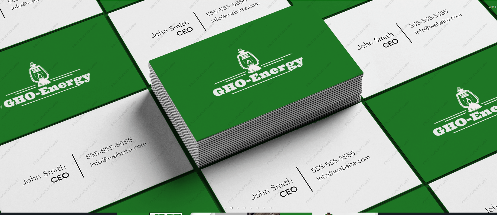

# GHO-Energy

## **GHO-Energy**

**Activating Sustainable energy project in Africa using onchain mechanics (GHO and Chainlink) and establishing a link between energy communities and crowdlending to finance projects.**

## Inspiration

The inspiration for GHO-Energy emerged from the growing need to address climate change at a hyper-local level especially in Africa and the desire to empower local communities in managing their energy resources. The platform is designed to facilitate energy community creation and crowdlending, which allows multiple investors to pool their money together to fund a project.



**The Problem :**

Sustainable energy growth faces the following hurdles in Africa:

1. Governance: creating a community with trusted parties.

2. Financing: access to the right capital and investors (funders) want an easier way to find & invest in projects.

3. Operational support: energy trading and connections to the stakeholders.

With GHO-Energy, anyone anywhere can transform their renewable energy resources into a vested community of energy sharing stakeholders.

Imagine if you could be part of a renewable energy community and contribute and earn from it while having both financial gains and a cleaner climate as the upside.

## What it does

Implementing a groundbreaking Sustainable Energy Project in Africa involves leveraging onchain mechanics, specifically utilizing the robust capabilities of GHO and Chainlink. This initiative aims not only to harness the potential of blockchain technology but also to forge a vital connection between energy communities and crowdlending platforms for project financing. The integration of onchain mechanisms, such as GHO and Chainlink, enhances the efficiency and transparency of the entire process, ensuring a seamless execution of sustainable energy initiatives across the African continent.

The utilization of GHO and Chainlink introduces a sophisticated layer of decentralized technology, enabling secure and tamper-resistant transactions. This not only safeguards the integrity of the sustainable energy project but also establishes a foundation of trust among stakeholders. Furthermore, the establishment of a direct link between energy communities and crowdlending platforms presents an innovative approach to financing. By fostering a collaborative environment, this connection facilitates the flow of funds from diverse sources, ensuring a more resilient and inclusive financial model.

In essence, the Sustainable Energy Project in Africa, driven by onchain mechanics like GHO and Chainlink, becomes a catalyst for positive change. It not only addresses the pressing need for sustainable energy solutions but also pioneers a novel approach to project financing. Through the seamless integration of blockchain technology, this initiative sets a precedent for future endeavors in the realm of sustainable development, emphasizing transparency, security, and community-driven support as the cornerstones of excellence.

### **Our Solution**

A dApp that allows users to:

1. Create an energy community with DAO governance
2. Raise financing through a crowd lending campaign
3. Local energy trading and a dashboard to track your renewable energy positive impact
4. GHO Token as the accepted currency in this energy DAO
5. GHO Token is a utility token that can be used to pay for energy consumption and to pay for energy production
6. GHO Token is also used to pay for energy community maintenance and operations

## Demo Links

Youtube demo : <https://youtu.be/xP5mQCRhnio>
Demo Url : <https://gho-energy.vercel.app/>

### **Our Vision**

GHO-Energy is a DAO based platform designed to facilitate the management of energy communities. The project creates a platform to enable individuals to build and join "energy communities" (group of people who can pool energy & resources) with DAO governance, create campaigns to raise funds for sustainable energy projects, and invest in sustainable energy and climate protection projects. The platform is designed to facilitate energy community creation and crowdlending with GHO token, which allows multiple investors to pool their money together to fund a project.

We are leveraging Chainlink Functions to:

1. Fetch consumption and production data for your community members from the energy distributor.
2. Gather energy prices from the electricity market, presently inclusive of the Iberian Market—Portugal and Spain.
3. Fetch energy tariffs from the regulator, currently only in Portugal.
4. Execute an algorithm that calculates the equilibrium price and the transactions within your community every hour.
5. Making the project a multi-chain project.

## How we built it

Tech stack:
React, Typescript, Tailwind, EVM-compatible smart contracts written in Solidity provides business logic and trust for the platform IPFS to store images of energy community membership NFTs, Chainlink Functions with Automation, Magic Link for both web2 and web3 login.

Smart contract functionalities:
The smart contracts used in GHO-Energy provide the following:

1. Create new Communities: Users can use the platform to create energy communities with a DAO governance. Energy Community is defined in regulatory frameworks across Europe and USA to allow citizens, businesses and public entities to take an active role in decarbonization. One of the advantages is the possibility of exchanging energy between the members of the community in a P2P scheme.
2. DAO governance: The DAO should help members decide who is in or out of the community, and allow for shared decision making on investments, assets maintenance, energy sharing, community operation, etc.
   Financing: The Crowdloan smart contract allows investors to pledge assets to a particular community. During a certain period the funds are locked. Afterwards, the investors are able to withdraw their funds plus the yield.
3. Operational Support: The platform leverages Chainlink Functions to fetch: a. energy prices from electricity market, b. energy tariffs from the regulator c. community members consumption and production from the energy distributor and d. execute market algorithm (double auction) to calculate the equilibrium price and transaction every hour. The data is stored on chain, can be used by 3rd party providers to bill members according to the market results. It could also be used, for an on-chain settlement between members of the community.

## Challenges we ran into

We took up the challenge of aggregating the data from various sources and incorporating Chainlink Functions to build the most informative level of dashboard info for our users. Our solution works to bridge Web3 with Web2 and we found the process was very helpful using Chainlink.
We will work on solving the local electric regulatory issues with further reach into the markets and we find that certain markets are more open to energy communities formation. We see our project development in creating a hybrid of an dApp and a educational resource to help bring the communities of stakeholders onboard with this streamlined way of energy communities.

## Accomplishments that we're proud of

We excited about finishing our dApp for the hackathon and building a well-coordinated team with clear vision for developing the project. We’ve managed to allow the creation of an energy community, bring on-board community members, generate a crowd lending campaign, and build a dashboard with data coming in from multiple sources using Chainlink.

## What we learned

We learned that when re-thinking existing energy communities with a blockchain based governance it fundamentally changes the game and creates new opportunities and a better alignment with the best pricing for solar users. The Chainlink Functions feature opened up possibilities to integrate off-chain data that makes the market algorithm execution smooth and efficient. The whole process makes it easier to make decisions as an energy community and as stakeholders in the community.

## What's next for GHO-Energy

With the right funding we aim to:

**1. Release and Launch MVP on Testnet:** Our primary focus during this phase will be to ensure that the initial features and functions of the platform are running smoothly. This includes the implementation of governance protocols, financing mechanisms, and operational support for energy trading. By launching our MVP on Testnet, we can gather vital feedback and address any potential issues before deploying the platform on the mainnet. This iterative process will help us to create a reliable, robust, and user-friendly platform for our users.

**2. Onboard First Industrial Community:** Once our platform has been thoroughly tested and refined, our next goal is to onboard our first industrial community. We will work closely with this community to facilitate the integration process and provide necessary support. Their feedback will help us to better understand user needs and improve our services. This practical application will provide us invaluable insights into the real-world utility of our platform and will give us a solid foundation for attracting more communities in the future.

**3. Expand Platform Features and Capabilities:** Our third goal is to continue to develop and refine our platform based on the needs of our growing user base. This could include introducing additional financial instruments, creating more sophisticated governance mechanisms, or developing advanced AI capabilities to optimize energy trading. By continuously enhancing our platform, we will ensure that it remains at the cutting edge of the energy sector and that it continues to provide the best possible value to our users. We will also explore partnerships with other organizations to expand our reach and improve our platform's effectiveness.

## Deployed on Sepolia

deploying "CrowdloanFactory" (tx: 0x1f0d6b06021335b350351fff052828b393c72d1dc8af377b3bfce942d90ecbad)...: deployed at 0x42Fc1d53EcF8B4c46989da0d44f07490668338c8 with 1711295 gas

deploying "CommunityItemsFactory" (tx: 0xe727f87f1833bea8ef89c4a434a350f6da8249b584dd18e015d6bb97eb45edc0)...: deployed at 0xEbb3113e97eeaA16Dcc2FebD6a1617AB731066AE with 3058926 gas

deploying "TimeLockFactory" (tx: 0x02fd893a61e621ccc643412555b4e0fa258d3d6cb1213a4cdb967bac8c815008)...: deployed at 0x5E4e5347eB417982375Ef9BDe0B77F4322FCF79F with 2077603 gas

deploying "GovernanceFactory" (tx: 0xb3d270abab87b699fbde751fa9b6a3f23a88ccc38b74e760419f05cffbf76a28)...: deployed at 0x1B7a6536f23a16e198246A3f80Cd646f86856F11 with 5081541 gas

deploying "CommunityFactory" (tx: 0x25ede639744c2630b8462195bc129a63b33646ead29e635c6c47460849f56195)...: deployed at 0x60cF847C6Ea49009ae290F749451F4CB66CAD0B2 with 1358395 gas

## Deployed on Avalanche C Chain

deploying "CrowdloanFactory" (tx: 0x1f0d6b06021335b350351fff052828b393c72d1dc8af377b3bfce942d90ecbad)...: deployed at 0x0e033D0A7ab13ab4E55206bA80d53179d9439de4 with 1711295 gas

deploying "CommunityItemsFactory" (tx: 0xe727f87f1833bea8ef89c4a434a350f6da8249b584dd18e015d6bb97eb45edc0)...: deployed at 0xEbb3113e97eeaA16Dcc2FebD6a1617AB731066AE with 3058926 gas

deploying "TimeLockFactory" (tx: 0x02fd893a61e621ccc643412555b4e0fa258d3d6cb1213a4cdb967bac8c815008)...: deployed at 0x5E4e5347eB417982375Ef9BDe0B77F4322FCF79F with 2077603 gas

deploying "GovernanceFactory" (tx: 0xb3d270abab87b699fbde751fa9b6a3f23a88ccc38b74e760419f05cffbf76a28)...: deployed at 0x1B7a6536f23a16e198246A3f80Cd646f86856F11 with 5081541 gas

deploying "CommunityFactory" (tx: 0x25ede639744c2630b8462195bc129a63b33646ead29e635c6c47460849f56195)...: deployed at 0x60cF847C6Ea49009ae290F749451F4CB66CAD0B2 with 1358395 gas

## Gho Integration

```typescript
import {
  Pool,
  InterestRate,
  EthereumTransactionTypeExtended,
} from "@aave/contract-helpers";
import { BigNumber, providers } from 'ethers';

  function submitTransaction({
    provider: ethers.providers.provider,  // Signing transactions requires a wallet provider
    tx: EthereumTransactionTypeExtended
  }) {

    const pool = new Pool(provider, {
      POOL: "0x3De59b6901e7Ad0A19621D49C5b52cC9a4977e52", // Goerli GHO market
      WETH_GATEWAY: "0x9c402E3b0D123323F0FCed781b8184Ec7E02Dd31", // Goerli GHO market
    });

    const extendedTxData = await tx.tx();
    const { from, ...txData } = extendedTxData;
    const signer = provider.getSigner(from);
    const txResponse = await signer.sendTransaction({
      ...txData,
      value: txData.value ? BigNumber.from(txData.value) : undefined,
    });

    const txs: EthereumTransactionTypeExtended[] = await pool.borrow({
      user: "0xa6D6f4556B022c0C7051d62E071c0ACecE5a1228",
      reserve: "0xcbE9771eD31e761b744D3cB9eF78A1f32DD99211", // Goerli GHO market
      amount: "125",
      interestRateMode: "InterestRate.Stable",
      0,
      //debtTokenAddress: "0xd4FEA5bD40cE7d0f7b269678541fF0a95FCb4b68", // Sepolia debt Token GHO market 0x54bdE009156053108E73E2401aEA755e38f92098
      //onBehalfOf,
      //referralCode,
    });
  }
```
